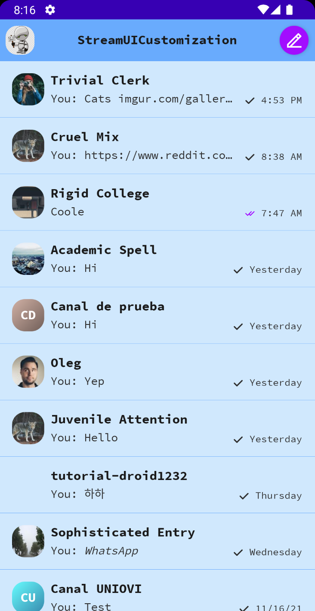
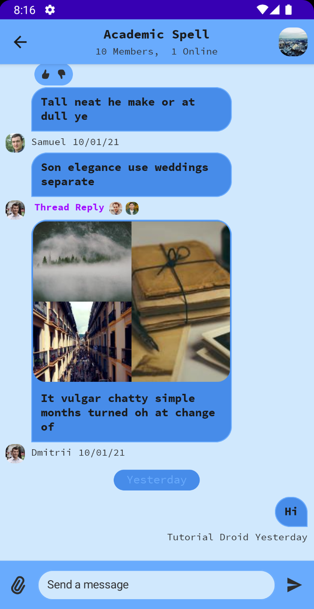
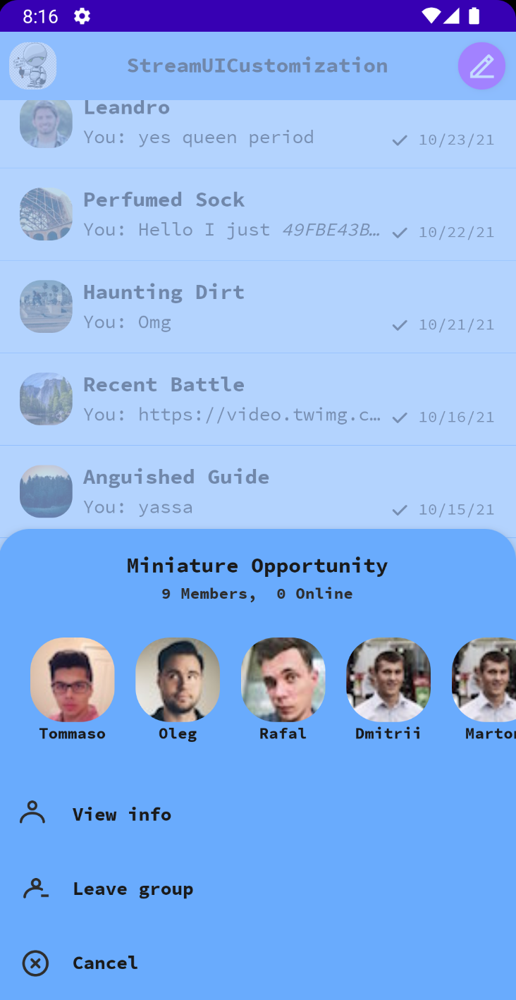
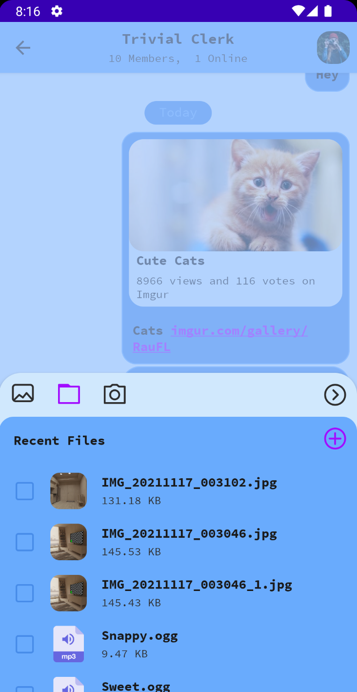

# Customizing Stream Compose UI Components
Stream’s Compose UI components make it easy for you to easily customize to your own requirements. In this article, you'll learn how to add your own colors, shapes and types.

You can find all the code in this article [on GitHub](https://github.com/wangerekaharun/StreamUICustomization).

**Note**: This article assumes you are unfamiliar with [Stream Jetpack Compose UI Components](https://getstream.io/blog/jetpack-compose-sdk/), checkout this [Jetpack Compose Chat Tutorial](https://getstream.io/chat/compose/tutorial/)

## Understanding `ChatTheme` Component

The `ChatTheme` component is the default wrapper for all your components. By default it has properties that style the whole application. Some of these properties include but not limited to: colors, typography and shapes. Using this, you can be able to provide a different set of colors, typography and shapes that apply to your whole chat app.

## Customizing your `ChatTheme` Component

To custom the `ChatTheme` component, you need to provide you own colors, shapes and typography. Doing this will overrid e the default ones provided by `ChatTheme`.

## Adding Custom Colors

To add colors from your own deisgn style, you need to use the `StreamColors` class. This contains all colors in the Stream color pallet.   

```kotlin
object CustomColors {
    val Primary = Color(0xFF69ABFD)
    val PrimaryDark = Color(0xFF478CE9)
    val PrimaryLight = Color(0xFFD0E8FD)
    val OverLay = Color(0xA0A2C8FF)
    val Accent = Color(0xFFA20DFF)
    val TextHigh = Color(0xFF1A1A1A)
    val TextLow = Color(0xFF2E2E2E)
}
```

In the code above you define custom colors that you'll use.

This is how it looks like:

```kotlin
val CustomLightStreamColors
    @Composable
    get() = StreamColors.defaultColors().copy(
        textHighEmphasis = CustomColors.TextHigh,
        textLowEmphasis = CustomColors.TextLow,
        disabled = CustomColors.PrimaryDark,
        borders = CustomColors.Primary,
        inputBackground = CustomColors.PrimaryLight,
        appBackground = CustomColors.PrimaryLight,
        barsBackground = CustomColors.Primary,
        linkBackground = CustomColors.PrimaryLight,
        overlay = CustomColors.OverLay,
        overlayDark = CustomColors.PrimaryDark,
        primaryAccent = CustomColors.Accent,
        highlight = CustomColors.PrimaryDark,
        ownMessagesBackground = CustomColors.PrimaryDark,
        otherMessagesBackground = CustomColors.PrimaryDark,
        deletedMessagesBackgroundColor = CustomColors.PrimaryDark
    )
```

In the code above, you provide your custom colors for the various params defined in this class. This will aply to your whole app. You can always change this values. Additionaly, you can still re-use the default ones by using the `Stream.defaultColors()`. This retruns an isntance which contains the Stream color pallete.

## Adding Custom Shapes

Shapes let you define the appearance of your components in your app. To customize the shapes , you use the `StreamShapes` class which has the shapes for different components.

```kotlin
val CustomStreamShapes = StreamShapes(
    avatar = RoundedCornerShape(40),
    myMessageBubble = RoundedCornerShape(topStart = 20.dp, topEnd = 20.dp, bottomStart = 20.dp),
    otherMessageBubble = RoundedCornerShape(topStart = 20.dp, topEnd = 20.dp, bottomEnd = 20.dp),
    inputField = RoundedCornerShape(24.dp),
    attachment = RoundedCornerShape(16.dp),
    imageThumbnail = RoundedCornerShape(10.dp),
    bottomSheet = RoundedCornerShape(topStart = 24.dp, topEnd = 24.dp),
)
```

## Adding Custom Typography

Typography allows you add fonts to your app. The `StreamTypography` class let's you defne custom Typography. First you need to add  your fonts inside the  **fonts** folder. Then create a variable for your added fonts:

```kotlin
val SourceCodePro = FontFamily(
    Font(R.font.sourcecodepro_regular),
    Font(R.font.sourcecodepro_bold, FontWeight.Bold)
)
```

This now enables you to use `SourceCodePro` font in your custom definitions.

```kotlin
val StreamCustomTypography = StreamTypography(
    title1 = TextStyle(
        fontFamily = SourceCodePro,
        fontWeight = FontWeight.Normal,
        fontSize = 18.sp
    ),

    title3 = TextStyle(
        fontFamily = SourceCodePro,
        fontWeight = FontWeight.Normal,
        fontSize = 16.sp
    ),

    title3Bold = TextStyle(
        fontFamily = SourceCodePro,
        fontWeight = FontWeight.Bold,
        fontSize = 16.sp
    ),

    body = TextStyle(
        fontFamily = SourceCodePro,
        fontWeight = FontWeight.Normal,
        fontSize = 14.sp
    ),

    bodyItalic = TextStyle(
        fontFamily = SourceCodePro,
        fontWeight = FontWeight.Normal,
        fontStyle = FontStyle.Italic,
        fontSize = 14.sp
    ),

    bodyBold = TextStyle(
        fontFamily = SourceCodePro,
        fontWeight = FontWeight.Bold,
        fontSize = 14.sp
    ),

    footnote = TextStyle(
        fontFamily = SourceCodePro,
        fontWeight = FontWeight.Normal,
        fontSize = 12.sp
    ),

    footnoteItalic = TextStyle(
        fontFamily = SourceCodePro,
        fontWeight = FontWeight.Normal,
        fontStyle = FontStyle.Italic,
        fontSize = 12.sp
    ),

    footnoteBold = TextStyle(
        fontFamily = SourceCodePro,
        fontWeight = FontWeight.Bold,
        fontSize = 12.sp
    ),

    captionBold = TextStyle(
        fontFamily = SourceCodePro,
        fontWeight = FontWeight.Bold,
        fontSize = 12.sp
    ),

    tabBar = TextStyle(
        fontFamily = SourceCodePro,
        fontWeight = FontWeight.Normal,
        fontSize = 12.sp
    )
)
```

Now that you have all the custom components defined, it's time you apply them to `ChatTheme` .

## Joining the Pieces Together

Defining  custom `StreamTypography`, `StreamShapes` and `StreamColors` will not automatically apply to your app.You need to provide them to `ChatTheme`. You do this by:

```kotlin
ChatTheme(
    shapes = CustomStreamShapes,
    colors = if (isSystemInDarkTheme()) StreamColors.defaultDarkColors() else CustomLightStreamColors,
    typography = StreamCustomTypography
) {
    ChannelsScreen(
        title = stringResource(id = R.string.app_name),
        onItemClick = { channel ->
            startActivity(MessagesActivity.getIntent(this, channel.cid))
        },
        onBackPressed = { finish() }
    )
}
```

- You use the `shapes` property to provide your custom shapes.
- You use `colors` to provide your custom colors. Here you also need to provide colors on dark mode. The above example uses the default ones from Stream color pallete. You can choose to provide different one.
- you use `typography` to provide your custom typography.

You have to do this in all places where you have the `ChatTheme` for example the MessagesScreen if you have one. Failure to do so will result in the screen using the default Stream theming.

Your app will now look like this:

|  |  |
| ------------------------------------------------------------ | ------------------------------------------------------------ |
|  |  |


## Conclusion

In this article you've learnt how you can add your own custom theming to  Stream Compose UI components.

In case you missed it, you can find the full sample project with examples in this tutorial [on GitHub](https://github.com/wangerekaharun/StreamUICustomization).

The [Compose SDK](https://getstream.io/chat/docs/sdk/android/compose/overview/) is still in beta. In case you have any feedback on using the SDK, reach the team [on Twitter](https://twitter.com/getstream_io) and [on GitHub](https://github.com/GetStream/stream-chat-android).
